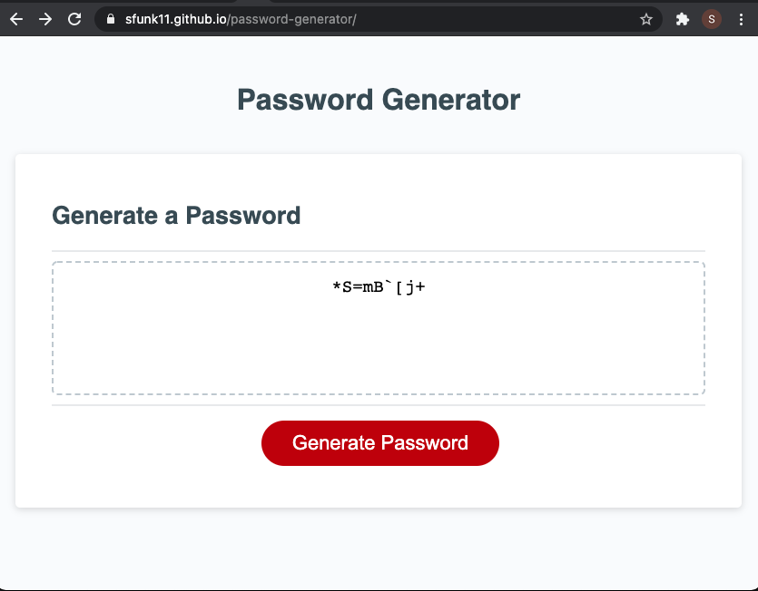

# Random Password Generator

## Description
This site generates a random password string that meets the criteria that the user enters. It will prompt the user for various criteria, and validate that the user has entered enough information to generate the password.

[Deployed Site](https://sfunk11.github.io/password-generator/)

## Steps to use

1.) User will be prompted to enter the length of password desired.
* If less than 8 or more than 128 is entered, the caller will get an error message and be prompted again.

2.) The user will be prompted to confirm which of the four types of password characters they want to include in their string.
* If the caller does not confirm any of the four criteria, then they will get an error message and be prompted for criteria again.

3.) The password will be generated.  Clicking the "Generate Password" button will re-generate a password using the same length and criteria each time it is pressed.

